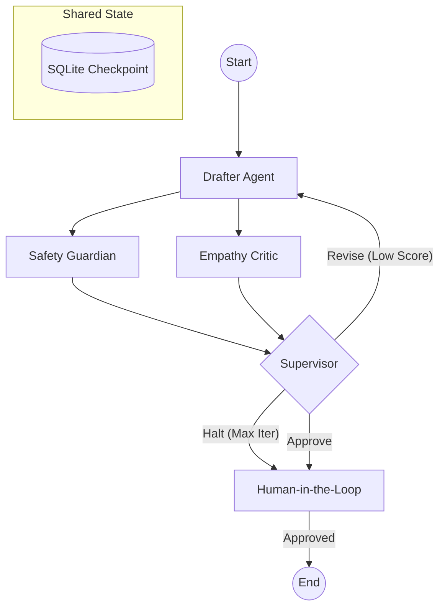

# Cerina Protocol Foundry

An intelligent multi-agent system that autonomously designs, critiques, and refines CBT exercises.

## Architecture



- **Backend**: Python, LangGraph, SQLite (Checkpointer).
- **Frontend**: React, TypeScript, Vite.
- **Interfaces**: REST API (Human-in-the-Loop) and MCP Server (Machine-to-Machine).

## Setup & Running

### 1. Backend
Install dependencies and run the API server:
```bash
poetry install
poetry run uvicorn backend.app:app --reload
```
The API will be available at `http://localhost:8000`.

### 2. Frontend
Install dependencies and start the dashboard:
```bash
cd frontend
npm install
npm run dev
```
The Dashboard will be available at `http://localhost:5173`.

### 3. MCP Server
To use with an MCP Client (like Claude Desktop):
```bash
poetry run python backend/mcp_server.py
```
Add this command to your Claude Desktop configuration under "mcpServers".

## Features
- **Multi-Agent Workflow**: Drafter, Safety, Empathy, and Supervisor agents collaborating in a directed cyclic graph.
- **Human-in-the-Loop**: The graph halts for human review before final approval or if iterations max out.
- **Persistence**: Activity is saved to `checkpoints.sqlite` and can be resumed exactly where it left off.
- **MCP Integration**: Exposes the workflow as a tool `generate_protocol` to MCP-compliant clients.
